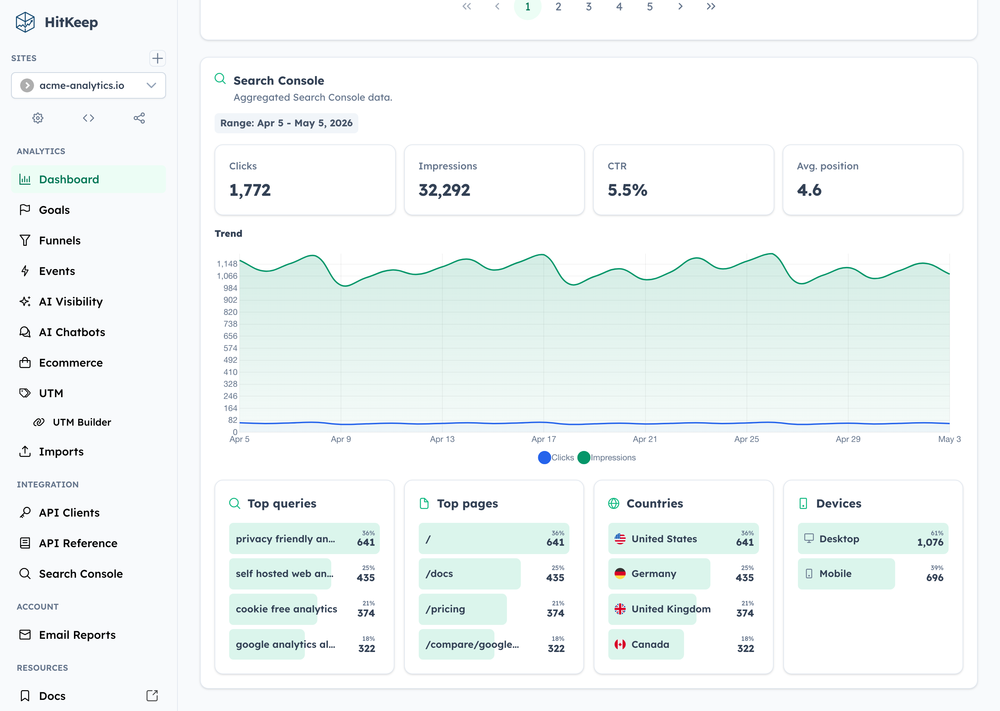
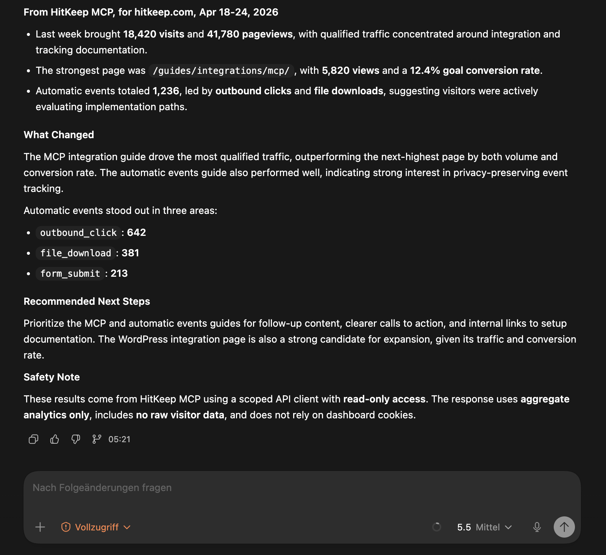

# HitKeep

> Privacy-first analytics for humans and AI agents, self-hosted or in EU/US cloud.

[](https://opensource.org/licenses/MIT)
[](https://go.dev/)
[](https://github.com/pascalebeier/hitkeep/pkgs/container/hitkeep)
[](https://hub.docker.com/r/pascalebeier/hitkeep)
[](https://hitkeep.com)
[](https://www.bestpractices.dev/projects/11990)

HitKeep is open source web analytics for teams that want useful product reporting without running PostgreSQL, Redis, ClickHouse, or a separate queue.

- Single Go binary with embedded DuckDB and NSQ
- Cookie-less tracker by default, with Do Not Track support
- Traffic, events, goals, funnels, ecommerce, UTM, and email reports
- Google Search Console aggregate import for query, page, country, and device reporting
- AI visibility analytics for crawler fetches and AI-referred visits
- Scoped API clients and a read-only MCP analytics server for approved agents
- Self-hosted or managed cloud with EU/US region choice

[AI Performance](https://hitkeep.com/ai-performance/) · [Website](https://hitkeep.com) · [Cloud](https://hitkeep.com/cloud) · [Live Demo](https://demo.hitkeep.com/share/7a55968bb42df256512fbe7ff73ab88f29dd45c236eddc818bd66420b4ffbaad) · [Docs](https://hitkeep.com/guides/introduction/) · [API](https://hitkeep.com/api/) · [Releases](https://github.com/PascaleBeier/hitkeep/releases)


## Why HitKeep

HitKeep is for teams that need clear web analytics, conversion reporting, and AI-era search visibility in one small operational footprint.

- **Low-ops self-hosting:** one binary, one data directory, embedded DuckDB and NSQ
- **Useful reports:** top pages, landing and exit pages, events, goals, funnels, ecommerce, UTM attribution, and Search Console aggregates
- **Privacy defaults:** focused data collection, cookie-less tracking, and DNT handling
- **AI visibility:** server-side crawler fetch analytics, AI-referred visits, and correlation reports
- **Team controls:** passkeys, TOTP, site/team permissions, share links, audit logs, API clients, and read-only MCP access
- **Deployment choice:** run it yourself or use managed cloud in the EU or US

## Quick Start

### Binary

Download the latest release for your system:

```bash
wget https://github.com/PascaleBeier/hitkeep/releases/latest/download/hitkeep-linux-arm64
chmod +x hitkeep-linux-arm64
export HITKEEP_JWT_SECRET="replace-this-with-a-long-random-string"
./hitkeep-linux-arm64 -public-url="http://localhost:8080"
```

Open `http://localhost:8080` and create your first account.

### Docker

```yaml
services:
  hitkeep:
    image: pascalebeier/hitkeep:latest
    restart: unless-stopped
    ports:
      - "8080:8080"
    volumes:
      - hitkeep_data:/var/lib/hitkeep/data
    environment:
      HITKEEP_JWT_SECRET: replace-this-with-a-long-random-string
    command:
      - "-public-url=http://localhost:8080"

volumes:
  hitkeep_data: {}
```

```bash
docker compose up -d
```

For production setup, reverse proxies, SMTP, systemd, Kubernetes, S3 archiving, and every configuration flag, use the docs instead of this README:

- [Installation guides](https://hitkeep.com/guides/installation/)
- [Configuration reference](https://hitkeep.com/reference/configuration/)
- [Cloud documentation](https://hitkeep.com/cloud)

## Track Your Site

Once your instance is running and a site is created, add:

```html
<script async src="https://your-hitkeep-instance.com/hk.js"></script>
```

Custom event example:

```html
<script>
  window.hk = window.hk || {};
  window.hk.event?.("signup", { plan: "pro", source: "landing-page" });
</script>
```

Tracker options, ecommerce events, custom events, and advanced tracking examples live here:

- [Tracking docs](https://hitkeep.com/guides/tracking/)
- [Custom events](https://hitkeep.com/guides/tracking/custom-events/)
- [Ecommerce analytics](https://hitkeep.com/guides/analytics/ecommerce/)
- [Google Search Console integration](https://hitkeep.com/guides/integrations/google-search-console/)
- [MCP analytics access](https://hitkeep.com/guides/integrations/mcp/)
- [WordPress integration](https://hitkeep.com/guides/integrations/wordpress/)
- [AI visibility analytics](https://hitkeep.com/guides/analytics/ai-visibility/)
- [CloudFront AI crawler tracking](https://hitkeep.com/guides/tracking/cloudfront-ai-crawler-tracking/)
- [AI chatbot analytics](https://hitkeep.com/guides/analytics/ai-chatbot-analytics/)
- [REST API reference](https://hitkeep.com/api/)
- [Compliance overview](https://hitkeep.com/compliance/overview/)

## Product Tour

<details>
<summary>See five product screenshots</summary>

### Dashboard


### Ecommerce


### Search Console


### AI Visibility


### MCP Access


</details>

## Documentation

The maintained reference lives on `hitkeep.com`.

- [Getting started](https://hitkeep.com/guides/introduction/)
- [Installation](https://hitkeep.com/guides/installation/)
- [Configuration](https://hitkeep.com/reference/configuration/)
- [REST API reference](https://hitkeep.com/api/)
- [Compliance](https://hitkeep.com/compliance/overview/)
- [Privacy policy for cloud](https://hitkeep.com/legal/privacy-policy/)
- [Terms of service](https://hitkeep.com/legal/terms-of-service/)
- [Comparison pages](https://hitkeep.com/vs/)

## Cloud

HitKeep Cloud is live.

If you want the same product without running it yourself, start here:

- [Start in the EU](https://cloud.hitkeep.eu/signup)
- [Start in the US](https://cloud.hitkeep.com/signup)
- [Cloud overview](https://hitkeep.com/cloud)

## Development

Prerequisites:

- Go 1.26+
- Node.js 24+
- Make
- A working C toolchain for DuckDB builds

Build from source:

```bash
git clone https://github.com/pascalebeier/hitkeep.git
cd hitkeep
make build
./hitkeep
```

For day-to-day development:

```bash
make dev
```

This starts the Go backend with live reload and the Angular dashboard on `http://localhost:4200`.

For a seeded local workspace with demo data:

```bash
make dev-seed
```

Contributor docs and local development guides:

- [Contributing guide](./CONTRIBUTING.md)
- [Dashboard development notes](./frontend/dashboard/README.md)
- [Changelog](./CHANGELOG.md)

## License

Distributed under the MIT License. See [LICENSE](./LICENSE).
