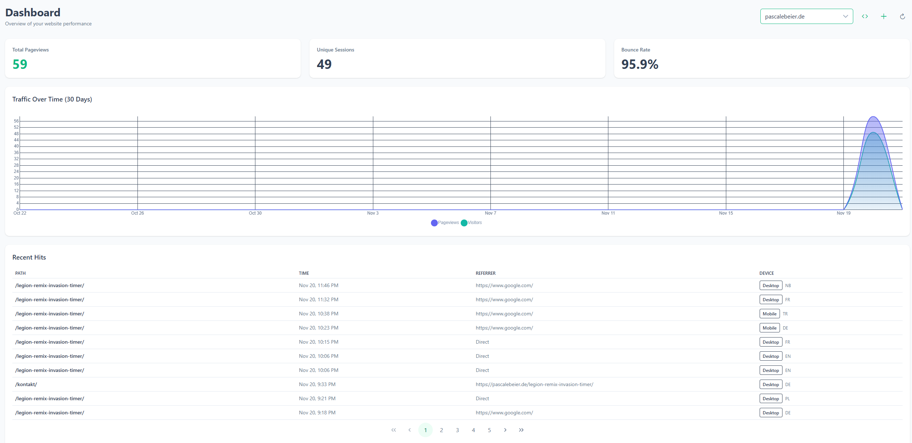

# HitKeep

> **Web Analytics in a single binary.**

[](https://opensource.org/licenses/MIT)
[](https://go.dev/)
[](https://github.com/pascalebeier/hitkeep/pkgs/container/hitkeep)

HitKeep is a self-hostable, privacy-first web analytics platform designed for **radical simplicity** without sacrificing performance.

Unlike other solutions that require you to manage a complex stack (PostgreSQL, Redis, ClickHouse, Nginx), HitKeep runs as a **single, self-contained executable**. It embeds a high-performance OLAP database (DuckDB) and a distributed message queue (NSQ) directly into the binary.



## Features

*   **Zero External Dependencies:** No database server to provision. No Redis to manage. Just download and run.
*   **Embedded DuckDB:** Utilizes a high-performance, column-oriented SQL database optimized for analytical queries.
*   **High-Throughput Ingestion:** Uses an embedded, in-process NSQ instance to buffer high volumes of traffic efficiently.
*   **Privacy First:** Cookie-less tracking, respects Do Not Track (DNT), and fully self-hosted data sovereignty.
*   **Cluster Ready:** Architecture supports Leader/Follower replication using HashiCorp Memberlist for high availability (optional).
*   **Modern Dashboard:** Fast, responsive UI built with Angular and PrimeNG.

## Library State

This is currently a PoC - it is already being used in production but lacks vital features.

### Roadmap

- [ ] endpoint rate limiting through nsq
- [ ] Raw hit pruning 
- [ ] better OLAP integration - no more Adhoc buckets
- [ ] Allow users to opt out of 
- [ ] User management
- [ ] Settings management
- [ ] More Metrics - currently it only shows the last 30 days
- [ ] Takeout
- [ ] Events integration

## Quick Start

### Method 1: Docker (Recommended)

Also see [examples](./examples/).

1.  Create a `compose.yml` file:

```yaml
services:
  hitkeep:
    image: ghcr.io/pascalebeier/hitkeep:latest
    container_name: hitkeep
    restart: unless-stopped
    ports:
      - "8080:8080"
    volumes:
      - hitkeep_data:/var/lib/hitkeep/data
    command:
      # IMPORTANT: Set this to your actual public domain in production
      - "-public-url=http://localhost:8080"
      - "-jwt-secret=replace-this-with-a-long-random-string"

volumes:
  hitkeep_data: {}
```

2.  Run it:
    ```bash
    docker compose up -d
    ```

3.  Open `http://localhost:8080` to create your admin account.

## Tracking Snippet

Once your instance is running and you have created a website in the dashboard, add this script to the `<head>` of your website:

```html
<script 
  src="https://your-hitkeep-instance.com/hk.js" 
  async 
  defer>
</script>
```

## Configuration

HitKeep is configured via command-line flags.

| Flag | Default | Description |
| :--- | :--- | :--- |
| `-http` | `:8080` | Address to bind the HTTP server to. |
| `-db` | `hitkeep.db` | Path to the DuckDB database file. |
| `-public-url` | `http://localhost:8080` | **Required.** The public URL of your instance. Used for JWT claims and CORS. |
| `-jwt-secret` | *(random)* | **Required.** Secret key for signing auth tokens. |
| `-log-level` | `info` | Logging level (`debug`, `info`, `warn`, `error`). |
| `-name` | `hostname-timestamp` | Unique node name for clustering. |
| `-bind` | `0.0.0.0:7946` | Bind address for cluster gossip (Memberlist). |
| `-join` | `""` | Address of a peer node to join (if running a cluster). |

## Architecture

HitKeep bridges the gap between simple log analyzers (like GoAccess) and enterprise analytics (like Umami/Plausible).

1.  **Ingestion:** Requests hit the Go HTTP server.
2.  **Buffering:** Events are published to an **embedded NSQ** topic (`hits`) in memory. This decouples the API from the database write speed.
3.  **Storage:** An internal consumer creates micro-batches and writes them to **DuckDB**, a columnar database that lives in a single file but offers OLAP performance comparable to ClickHouse.
4.  **Clustering:** Nodes communicate via Gossip protocol. The **Leader** node handles database writes, while **Follower** nodes proxy ingestion traffic to the leader.

## Development

### Prerequisites
*   Go 1.25+
*   Node.js 22+
*   Make

### Build from source

```bash
# Clone the repo
git clone https://github.com/pascalebeier/hitkeep.git
cd hitkeep

# Build frontend and backend
make build

# Run the binary
./hitkeep
```

## License

Distributed under the MIT License. See `LICENSE` for more information.