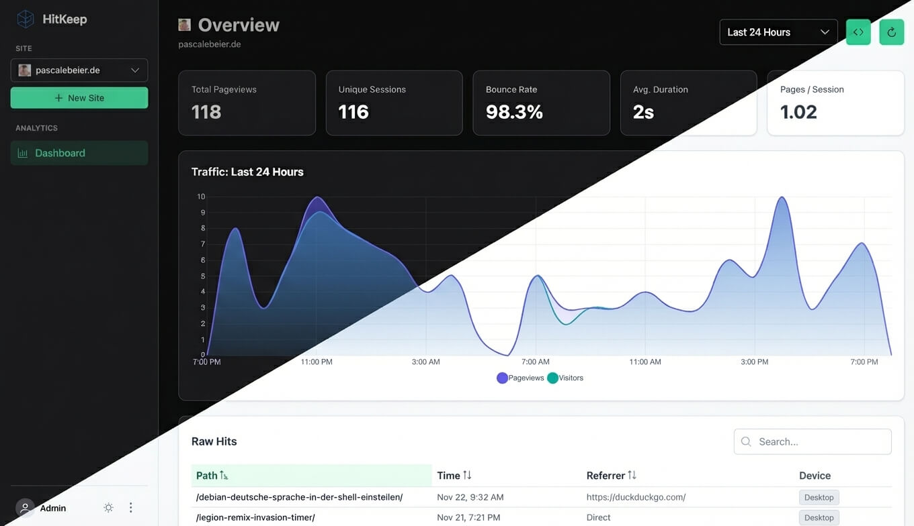

# HitKeep

> **Web Analytics in a single binary.**

[](https://opensource.org/licenses/MIT)
[](https://go.dev/)
[](https://github.com/pascalebeier/hitkeep/pkgs/container/hitkeep)

HitKeep is a self-hostable, privacy-first web analytics platform designed for **radical simplicity** without sacrificing performance.

Unlike other solutions that require you to manage a complex stack (PostgreSQL, Redis, ClickHouse, Nginx), HitKeep runs as a **single, self-contained executable**. It embeds a high-performance OLAP database (DuckDB) and a distributed message queue (NSQ) directly into the binary.



## Features

*   **Zero External Dependencies:** No database server to provision. No Redis to manage. Just download and run.
*   **Embedded DuckDB:** Utilizes a high-performance, column-oriented SQL database optimized for analytical queries.
*   **High-Throughput Ingestion:** Uses an embedded, in-process NSQ instance to buffer high volumes of traffic efficiently.
*   **Privacy First:** Cookie-less tracking, respects Do Not Track (DNT), and fully self-hosted data sovereignty.
*   **Cluster Ready:** Architecture supports Leader/Follower replication using HashiCorp Memberlist for high availability (optional).
*   **Modern Dashboard:** Fast, responsive UI built with Angular and PrimeNG.

## Library State

This is a heavy WIP, just past PoC and MVP - it is already being used in production but lacks vital features.

### Roadmap

- [x] endpoint rate limiting through nsq
- [ ] Raw hit pruning 
- [x] better OLAP integration - no more Adhoc buckets
- [x] Allow users to opt out of sendBeacon
- [ ] User management
- [ ] Settings management
- [x] More Metrics - currently it only shows the last 30 days
- [ ] Helm chart
- [ ] Data retention and archival with parquets
- [ ] Takeout - also with parquets to csv with duckdb
- [ ] Events integration


## Quick Start

### Binary

Head over to [Releases](https://github.com/PascaleBeier/hitkeep/releases) and download the Binary for your system, for example:

```bash
$ wget https://github.com/PascaleBeier/hitkeep/releases/download/v1.2.0/hitkeep-linux-arm64
$ chmod +x hitkeep-linux-arm64
```

#### Running

```bash
# assuming you run this behind a proxy / lb pointing to localhost:8080 
$ ./hitkeep-linux-arm64 -public-url="https://analytics.example.org" 
# to use your public ip 
$ ./hitkeep-linux-arm64 -public-url="http://1.2.3.4:8080"
```

### Docker

Also see [examples](./examples/).

1.  Create a `compose.yml` file:

```yaml
services:
  hitkeep:
    image: ghcr.io/pascalebeier/hitkeep:latest
    container_name: hitkeep
    restart: unless-stopped
    ports:
      - "8080:8080"
    volumes:
      - hitkeep_data:/var/lib/hitkeep/data
    command:
      # IMPORTANT: Set this to your actual public domain in production
      - "-public-url=http://localhost:8080"
      - "-jwt-secret=replace-this-with-a-long-random-string"

volumes:
  hitkeep_data: {}
```

2.  Run it:
    ```bash
    docker compose up -d
    ```

3.  Open `http://localhost:8080` to create your admin account.

## Tracking Snippet

Once your instance is running and you have created a website in the dashboard, add this script to the `<head>` of your website:

```html
<script async src="https://your-hitkeep-instance.com/hk.js"></script>
```

### Do-Not-Track

To ignore DNT:

```html
<script async src="https://your-hitkeep-instance.com/hk.js" data-collect-dnt="true"></script>
```

### fetch over sendBeacon

To use fetch over navigator.sendBeacon:

```html
<script async src="https://your-hitkeep-instance.com/hk.js" data-collect-dnt="true" data-disable-beacon="true"></script>
```

## Configuration

HitKeep is configured via command-line flags or environment variables. Flags take precedence.
Here is the comprehensive configuration reference for your `README.md`.

### General Settings

| Flag          | Environment Variable | Default                 | Description                                                                  |
|:--------------|:---------------------|:------------------------|:-----------------------------------------------------------------------------|
| `-public-url` | `HITKEEP_PUBLIC_URL` | `http://localhost:8080` | **Required.** The public URL of your instance. Used for JWT issuer and CORS. |
| `-jwt-secret` | `HITKEEP_JWT_SECRET` | *(random)*              | **Required.** Secret key for signing auth tokens.                            |
| `-http`       | `HITKEEP_HTTP_ADDR`  | `:8080`                 | Address to bind the HTTP server to.                                          |
| `-db`         | `HITKEEP_DB_PATH`    | `hitkeep.db`            | Path to the DuckDB database file.                                            |
| `-log-level`  | `HITKEEP_LOG_LEVEL`  | `info`                  | Logging verbosity (`debug`, `info`, `warn`, `error`).                        |

### Mailer (SMTP)

| Flag                         | Environment Variable                | Default             | Description                                                     |
|:-----------------------------|:------------------------------------|:--------------------|:----------------------------------------------------------------|
| `-mail-driver`               | `HITKEEP_MAIL_DRIVER`               | `smtp`              | Mail driver to use (`smtp` or `log`).                           |
| `-mail-host`                 | `HITKEEP_MAIL_HOST`                 |                     | SMTP Server Hostname (e.g., `smtp.postmarkapp.com`).            |
| `-mail-port`                 | `HITKEEP_MAIL_PORT`                 | `587`               | SMTP Server Port.                                               |
| `-mail-username`             | `HITKEEP_MAIL_USERNAME`             |                     | SMTP Username.                                                  |
| `-mail-password`             | `HITKEEP_MAIL_PASSWORD`             |                     | SMTP Password.                                                  |
| `-mail-encryption`           | `HITKEEP_MAIL_ENCRYPTION`           | `tls`               | Encryption mode: `tls` (STARTTLS), `ssl` (Implicit), or `none`. |
| `-mail-insecure-skip-verify` | `HITKEEP_MAIL_INSECURE_SKIP_VERIFY` | `false`             | Skip TLS certificate validation (useful for self-signed certs). |
| `-mail-from-address`         | `HITKEEP_MAIL_FROM_ADDRESS`         | `hitkeep@localhost` | The email address messages are sent from.                       |
| `-mail-from-name`            | `HITKEEP_MAIL_FROM_NAME`            | `HitKeep`           | The name displayed to the recipient.                            |

### Rate Limiting

| Flag            | Environment Variable        | Default | Description                                        |
|:----------------|:----------------------------|:--------|:---------------------------------------------------|
| `-ingest-rate`  | `HITKEEP_INGEST_RATE_LIMIT` | `20.0`  | Rate limit for `/ingest` (req/sec/ip).             |
| `-ingest-burst` | `HITKEEP_INGEST_BURST`      | `40`    | Burst size for `/ingest`.                          |
| `-api-rate`     | `HITKEEP_API_RATE_LIMIT`    | `10.0`  | Rate limit for general API endpoints (req/sec/ip). |
| `-api-burst`    | `HITKEEP_API_BURST`         | `20`    | Burst size for general API.                        |
| `-auth-rate`    | `HITKEEP_AUTH_RATE_LIMIT`   | `2.0`   | Rate limit for login/signup (req/sec/ip).          |
| `-auth-burst`   | `HITKEEP_AUTH_BURST`        | `5`     | Burst size for login/signup.                       |

### Clustering & Internals

| Flag                | Environment Variable       | Default              | Description                                   |
|:--------------------|:---------------------------|:---------------------|:----------------------------------------------|
| `-name`             | `HITKEEP_NODE_NAME`        | `hostname-timestamp` | Unique name for this node in the cluster.     |
| `-bind`             | `HITKEEP_BIND_ADDR`        | `0.0.0.0:7946`       | Bind address for cluster gossip (Memberlist). |
| `-join`             | `HITKEEP_JOIN_ADDR`        | `""`                 | Address of a peer node to join.               |
| `-nsq-tcp-address`  | `HITKEEP_NSQ_TCP_ADDRESS`  | `127.0.0.1:4150`     | Address of the internal embedded NSQ TCP.     |
| `-nsq-http-address` | `HITKEEP_NSQ_HTTP_ADDRESS` | `127.0.0.1:4151`     | Address of the internal embedded NSQ HTTP.    |

## FAQ

### How much data storage will I need?

As of now, without any parqueting, you can expect to store 1 Million Raw Hits per ~120MB.

## Architecture

HitKeep bridges the gap between simple log analyzers (like GoAccess) and enterprise analytics (like Umami/Plausible).

1.  **Ingestion:** Requests hit the Go HTTP server.
2.  **Buffering:** Events are published to an **embedded NSQ** topic (`hits`) in memory. This decouples the API from the database write speed.
3.  **Storage:** An internal consumer creates micro-batches and writes them to **DuckDB**, a columnar database that lives in a single file but offers OLAP performance comparable to ClickHouse.
4.  **Clustering:** Nodes communicate via Gossip protocol. The **Leader** node handles database writes, while **Follower** nodes proxy ingestion traffic to the leader.

## Development

### Prerequisites
*   Go 1.25+
*   Node.js 22+
*   Make

### Build from source

```bash
# Clone the repo
git clone https://github.com/pascalebeier/hitkeep.git
cd hitkeep

# Build frontend and backend
make build

# Run the binary
./hitkeep
```

## Changelog

We use SemVer and Conventional Commits.

See [CHANGELOG.md](./CHANGELOG.md).

## License

Distributed under the MIT License. See `LICENSE` for more information.
